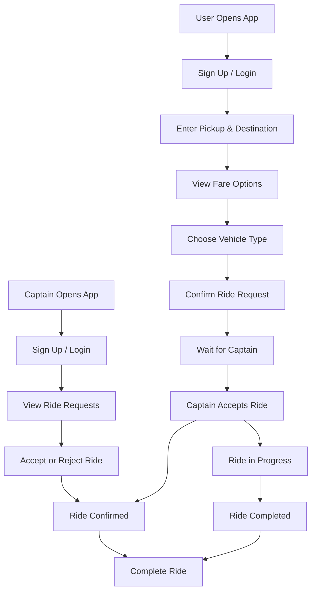

# Uber Clone Project

This project is a simplified ride-sharing application inspired by Uber. It supports two main roles:

- User: can sign up, log in, book a ride, choose a vehicle type, and track the ride.
- Captain: can sign up, log in, receive ride requests, accept or reject them, and complete the ride.

## Project Overview

The application is divided into two main parts:

- Frontend: built with React and Vite
- Backend: built with Node.js, Express, and MongoDB

The app simulates a ride-booking experience using real-looking screens and interactive ride flow states.

## Tech Stack

### Frontend
- React
- Vite
- React Router
- Tailwind CSS-like styling via utility classes
- GSAP animations
- Axios for API requests

### Backend
- Node.js
- Express.js
- MongoDB
- JWT authentication
- Socket.io for real-time ride updates

## User Process Flow

### 1. User Signup / Login
A new user can create an account with name, email, and password.
An existing user can log in and access the ride booking interface.

### 2. Search Ride
From the home page, the user enters:
- Pickup location
- Destination

The app fetches suggestions and estimates fares for available vehicle types.

### 3. Choose Vehicle Type
The user can view options such as:
- Auto
- Car
- Motorcycle

The selected vehicle shows the estimated fare.

### 4. Confirm Ride
After choosing a vehicle, the user confirms the ride request.
The system then waits for a captain to accept.

### 5. Ride in Progress
Once a captain accepts the request:
- the user sees the waiting and ride status
- the captain receives the ride details
- the ride can be completed and paid for

## Captain Process Flow

### 1. Captain Signup / Login
A captain can register with their details and sign in to the captain dashboard.

### 2. Receive Ride Request
After login, the captain sees ride requests from nearby users.
The captain can review details such as:
- pickup point
- destination
- fare
- ride status

### 3. Accept or Reject Ride
The captain can:
- accept the ride
- reject the ride

If accepted, the ride moves forward into the confirmed stage.

### 4. Ride Completion
After the trip is completed, the captain can finish the ride and the system updates the ride status.

## Graphical View



## Simple Workflow Summary

### User Journey
1. Register or log in
2. Enter pickup and destination
3. Choose a vehicle
4. Confirm the ride
5. Wait for a captain
6. Complete the ride

### Captain Journey
1. Register or log in
2. View incoming ride requests
3. Accept or reject a ride
4. Proceed with the ride
5. Finish the ride

## How the App Works

The app connects users and captains through a real-time flow:

- Users request rides from the frontend.
- The backend processes ride requests.
- Captains receive ride opportunities through the captain interface.
- Socket communication keeps the ride state synchronized.

## Installation

### Backend
```bash
cd backend
npm install
npm start
```

### Frontend
```bash
cd frontend
npm install
npm run dev
```

## Notes

This project is a learning-style clone and focuses on demonstrating the core ride-booking experience rather than providing a full production-ready deployment.
